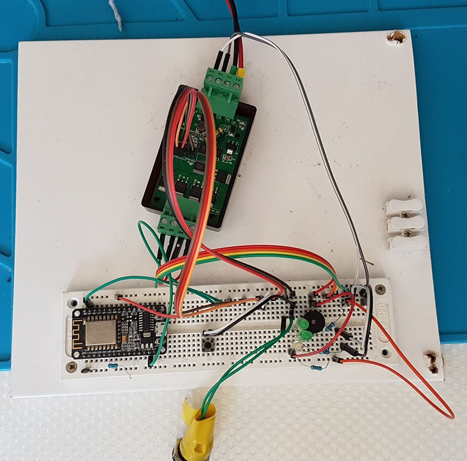

# ESPhome_H801_dimmer_with_buttons
ESPhome yaml for a 2 channel DC monochromatic dimmer with control buttons and some extras.

The H801 is a cheap esp8266 based 5 channe (RGBWW) dimmer. I am going to use this inmy kitchen for the ceiling and cabinet LED lights. They need to be locally controlled through push buttons - integrated into the wall as part of the existing installation. I use the Gira brand and in my case the kitchen is already prepared for this (separate DC low voltage cables inside the wall). In addition also being controllable through the home automation. At present I am using Domoticz.

Connection setup:

- 2 x PWM outputs to control two strings of LED lights
- 1 x Switch output to switch 12V (I have a 12V Internet radio / smart speaker that has no pwoer off button so I want to control the power)
- 2 x push buttons for the dimmer (one per light)
- 1 x push button to control the switch
- 1 x active buzzer (defined as a light output) to get audible feedback for events. The buzzer is connected to 12V through a resistor

Dimmer button behaviour:

- Single click: Toggle power of the light
- Double Click: Toggle between Max brightness and min brightness
- Hold: Toggle between dimming up and dimming down. While dimming, when max or min brightness is exceeded beep the buzzer once

Here's how it looks on a breadboard for testing:

